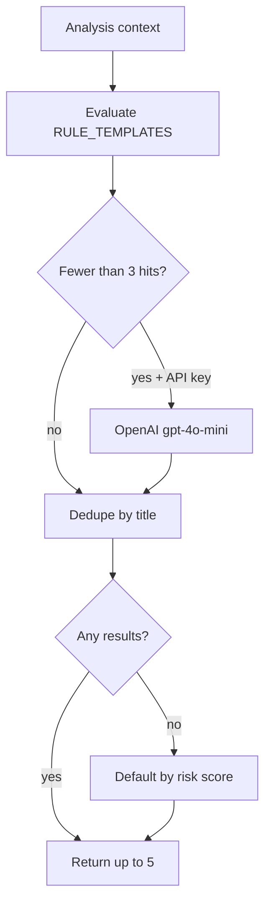

# AI Recommendation Rules

How environmental recommendations are generated, shaped, and displayed.

## Source of truth

| Layer | Path |
|-------|------|
| Engine | [`ai-recommendations/engine.py`](../ai-recommendations/engine.py) |
| Backend wrapper | [`backend/app/services/ai.py`](../backend/app/services/ai.py) |
| API schema | [`backend/app/models/schemas.py`](../backend/app/models/schemas.py) — `Recommendation` model |
| Frontend sort/summary | [`frontend/src/lib/insights.ts`](../frontend/src/lib/insights.ts) |
| UI | [`frontend/src/components/dashboard/InsightRecommendations.tsx`](../frontend/src/components/dashboard/InsightRecommendations.tsx) |

## API shape

Each recommendation:

```json
{
  "category": "plantation",
  "priority": "critical",
  "title": "Poor air quality and low greenery",
  "description": "This area has unhealthy air and very little vegetation. ...",
  "actions": ["Plant native trees along major roads", "..."]
}
```

- **Max returned:** 5 items from engine; UI shows top **3** by default with “View all”
- **Max actions per item:** 3 (enforced in rules and LLM post-processing)

## Generation pipeline



1. Evaluate all `RULE_TEMPLATES` conditions against pollution, weather, environmental, and risk dicts
2. If OpenAI key is set and fewer than 3 rule hits → request up to 2 additional items (dedupe by `title`)
3. If still empty → `_default_recommendation` based on risk score (healthy vs needs improvement)
4. Return at most **5** recommendations

## Rule templates (triggers)

| Category | Priority | Condition (summary) |
|----------|----------|---------------------|
| `plantation` | critical | AQI > 150 and vegetation index < 0.3 |
| `urban_cooling` | high | Urban heat index > 1.3 |
| `pollution_reduction` | high | AQI > 100 |
| `green_corridor` | medium | Green coverage < 20% |
| `water_conservation` | medium | Humidity < 30% |
| `vegetation` | medium | Vegetation index < 0.4 |

## Copy rules

### Do

- Use plain language for residents and planners
- Keep `description` to ~2 short sentences (why it matters **locally**)
- Provide exactly **3** specific, actionable bullets in `actions` when possible
- Keep `title` under ~8 words

### Do not

- Use jargon (e.g. “NDVI”) in user-facing `description`
- Use generic filler (“environmental conditions show room for improvement”)
- Exceed 3 actions per card or long paragraph descriptions
- Repeat the same recommendation title from rules and LLM

## LLM supplement rules

When `OPENAI_API_KEY` (or configured key) is present:

- Model: `gpt-4o-mini`, temperature `0.5`
- Prompt requires JSON array only, 2 items, same schema as rules
- Instructions: no jargon, max 3 actions, localized tone
- Parse failures → fall back to rules-only output

## Frontend presentation

### Hero (`buildInsightSummary`)

- Uses highest-priority recommendation `description` (trimmed ~140 chars)
- Appends first action as “Recommended: …” when present
- Fallback copy uses risk score and level if no recommendations

### Cards (`InsightRecommendations`)

| Section | Source |
|---------|--------|
| Environmental Risk | `rec.priority` badge + `analysis.risk.level` |
| Title | `rec.title` |
| Why This Matters | `rec.description` (`line-clamp-3`) |
| Suggested Actions | `rec.actions` slice(0, 3) |

Sort order: critical → high → medium → low (`PRIORITY_ORDER` in `insights.ts`).

## Priority semantics

| Priority | Typical use |
|----------|-------------|
| `critical` | Immediate health + environment harm |
| `high` | Significant issue requiring action soon |
| `medium` | Improvement recommended |
| `low` | Maintenance / healthy area |

## Future schema (optional)

A dedicated `why` field may alias `description` later; not required for current API consumers.
